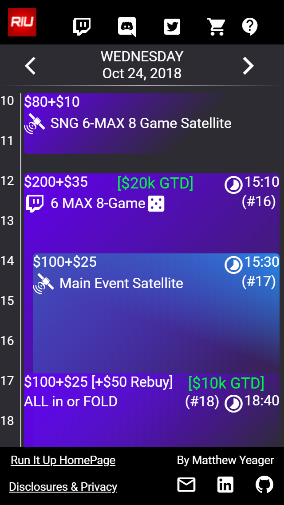
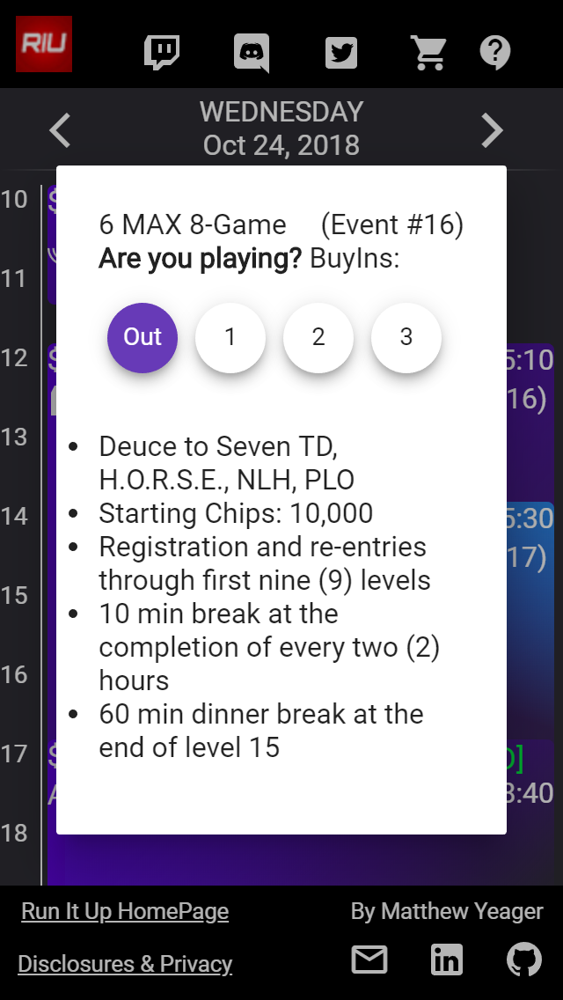
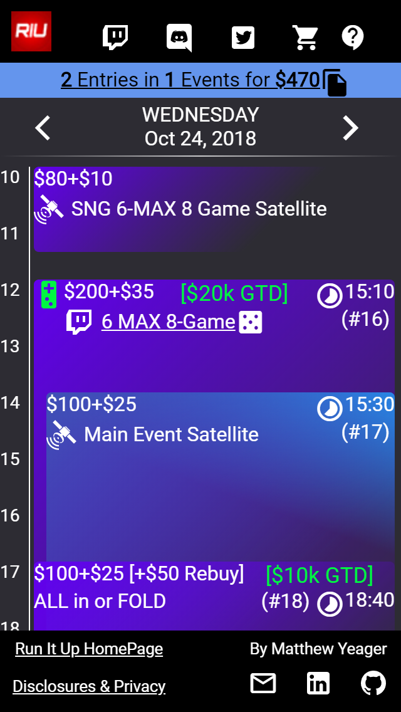
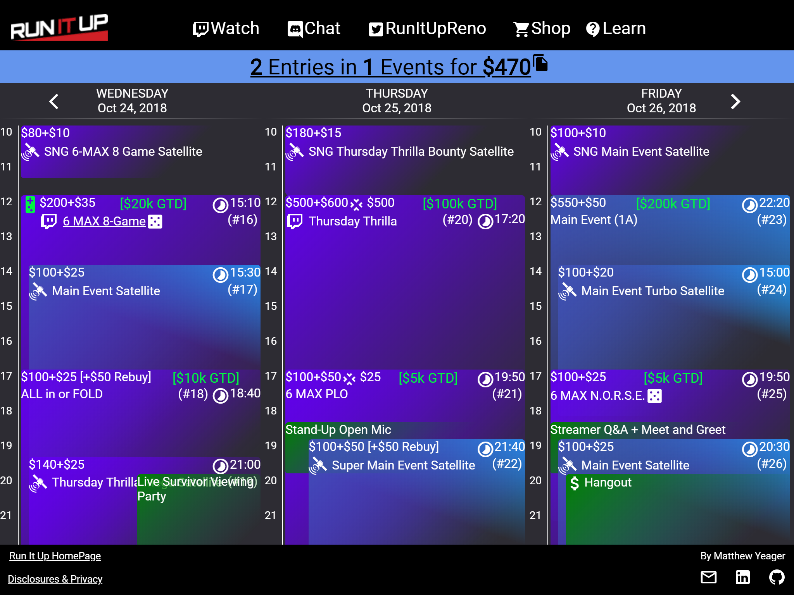

# Riureno

Event Schedule and Planner

Feature
- Responsive design for desktop and mobile
- Event Types: Mixed-Game, Satellite, Streamed
- Payout Tables: Buyin format, Guarantees
- Buyin calculator for planning events
- Share your schedule with customized link

<table>
    <tr>
        <td></td>
        <td></td>
        <td></td>
    </tr>
    <tr>
        <td colspan="3"></td>
    </tr>
</table>
## Development server

Run `ng serve` for a dev server. Navigate to `http://localhost:4200/`. The app will automatically reload if you change any of the source files.

## Build

Run `ng build` to build the project. The build artifacts will be stored in the `dist/` directory. Use the `--prod` flag for a production build.